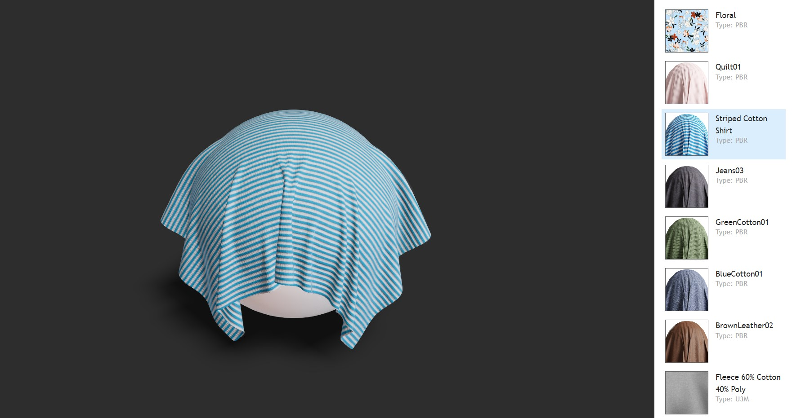

# Material Viewer

3D Material Viewer by using three.js and React.js

# Screenshot

## Install

Assumes you already have `node` installed. If you already have `yarn` installed you can skip the next command.

    npm install --global yarn

Install all dependencies for node

    yarn install

## Running

    yarn start

## Building

    yarn build

## Fixing lint

    yarn lint

## Fixing code format

    yarn format
